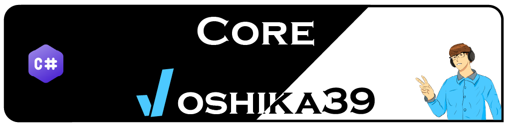

# C# Tools Library

`joshika39.Core` meant to enhance the basic C# functionalities, like the `Console.Readline` or storing data in `json` format. The project is actively being updated. If you have any enchantment idea create an [Enhancement Issue](https://github.com/joshika39/cs-tools/issues/new?assignees=&labels=enhancement&projects=&template=enhancement.md&title=New+Enhancement+name) or a [Bug](https://github.com/joshika39/cs-tools/issues/new?assignees=&labels=bug&projects=&template=bug.md&title=) on that matter.
## Stats

[](https://img.shields.io/nuget/vpre/joshika39.Core?link=https%3A%2F%2Fwww.nuget.org%2Fpackages%2Fjoshika39.Core%2F) [](https://github.com/joshika39/cs-tools/actions/workflows/modules-cicd.yml) [](https://analysis.bitof.faith/dashboard?id=joshika39_cs-tools_AYtHQMp2dB6aqkaimYly) [](https://analysis.bitof.faith/dashboard?id=joshika39_cs-tools_AYtHQMp2dB6aqkaimYly) [](https://analysis.bitof.faith/dashboard?id=joshika39_cs-tools_AYtHQMp2dB6aqkaimYly)
# Setting up
## As a package
 - Download the `Core` package from [nuget.org](https://www.nuget.org/packages/joshika39.Core) via any Nuget package manager
 - Downlaod it from [github.com](https://github.com/joshika39/cs-tools/pkgs/nuget/joshika39.Core) via any Nuget package manager
## How to start

First you have to create a new [`ServiceCollection`](https://learn.microsoft.com/en-us/dotnet/api/microsoft.extensions.dependencyinjection.servicecollection?view=dotnet-plat-ext-7.0) and then create an instance from the `CoreModule` class.

Then call the `LoadModules` function of the `CoreModule` class with the desired ***namespace***. 

> **NOTE:** The namespace is the scope of your project which uses the `joshika39.Core` package

Finally you can use the implementations from the result of the `collection.BuildServiceProvider()` which has a type of [`IServiceProvider`](https://learn.microsoft.com/en-us/dotnet/api/system.iserviceprovider?view=net-7.0&viewFallbackFrom=dotnet-plat-ext-7.0)
### Example
```cs
var collection = new ServiceCollection();  
new CoreModule().LoadModules(collection, "reader-tests"); 

var provider = collection.BuildServiceProvider();
```

**Check the [Wiki](https://github.com/joshika39/cs-tools/wiki) for further details.**